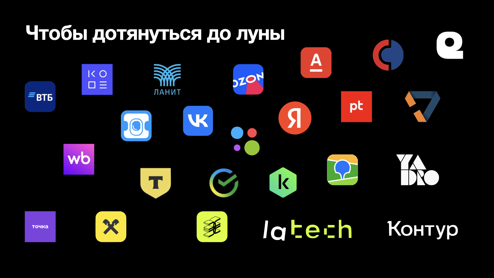
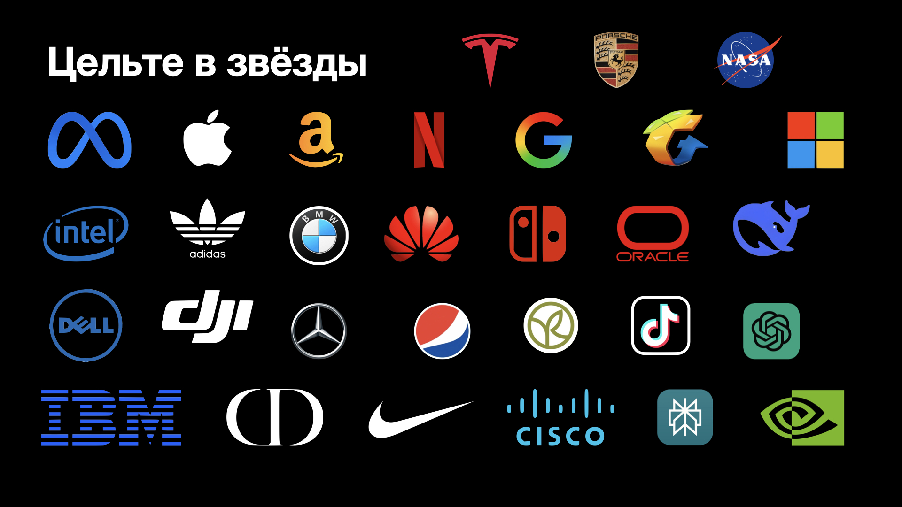

# Как попасть на стажировку в Яндекс

Это статья – текстовая версия выступления с [презентацией](./Как%20попасть%20на%20стажировку%20в%20Яндекс.pdf) в Школе 21. Я собрал [**все полезные ссылки**](./LINKS.md) из моего рассказа в одном месте.

## Оглавление

0. [Вступление (Кто я?)](#вступление-кто-я)
1. [Найди себя и цель](#найди-себя-и-цель)
2. [Подбери свой трек обучения](#подбери-свой-трек-обучения)
3. [Упакуй свой опыт](#упакуй-свой-опыт)
4. [Продай свой опыт](#продай-свой-опыт)
5. [Выжми максимум из стажировки](#выжми-максимум-из-стажировки)
6. [Двигайся дальше](#двигайся-дальше)
7. [Вместо эпилога](#вместо-эпилога)

## Вступление (Кто я?)

Привет!  
Я Василий Фролов. Студент (пир) Школы 21 с волны 23_10_KZN с ником `jenniffr`.  
Проходил интенсив, совмещая с работой администратором в отеле. После прохождения на основное обучение я уволился. Учился очно в Казанском кампусе больше года ([статья – история обучения](https://telegra.ph/God-mesyac-i-den-v-SHkole-21-11-24)). После чего вышел на стажировку Python-разработчиком в Кинопоиск. Потом на вторую стажировку в [Яндекс ID](https://yandex.ru/id/about), где и остался работать после.

Ещё немного фактов обо мне:

- С [Захаром](https://github.com/zkhrg) (diamondp) написал [бота](https://github.com/drveles-X-zkhrg/campus_map_bot) для поиска пиров в кампусе;
- Стал пиром года 2024 в номинации [Career Buddy](https://t.me/code_vasilii/13);
- Работал курьером в Лавке до первой стажировки;
- Сделал около [300 откликов](https://t.me/code_vasilii/7) до выхода на стажировку. Побывал суммарно более чем на 15 собеседованиях;

## Найди себя и цель

    Начни с начала, закончи где захочешь

Начать стоит с выбора профессии, которой хочешь заниматься. Заниматься стоит тем, что тебе действительно интересно, а не тем, где платят больше или легче попасть. Если в голову вообще ничего не приходит — стоит осмотреться по сторонам, начать можно [с этой статьи](https://practicum.yandex.ru/promo/work-guide/kak-vybrat-it-ili-digital-professiyu/) и людей, что тебя окружают.  
Но как вообще понять, что мне интересно? Всё просто – ты об этом думаешь больше всего. Если интересных направлений несколько – можно взять то, что первое пришло в голову. Например: любопытно разобраться во фронтенде или UX/UI дизайне. Бери фронтенд и разбирайся.  
Бывают профессии на стыке сфер. Например: ML + разработка = MLOps (инфраструктура для ИИ).

Выбрал направление – иди смотреть на референсы. А как живут люди, которые этим уже занимаются, а как они работают? Тебе такое подходит? Это могут быть как трудоустроенные пиры, так и люди из интернета. Хорошо помогает найти сообщество людей, которое целит в то же, что и ты. Вместе искать, учиться, проходить отборы и тд.  
И ещё одна мысль. Вообще эта профессия не навсегда. Ты будешь менять направления, компании и возможно вообще уйдёшь из IT и digital.

Далее надо поисследовать — какие языки, библиотеки и фреймворки используются в этой профессии?  
Какие мягкие навыки используются?  
Всё это можно узнать, почитав стажёрские вакансии на агрегаторах ([hh.ru](https://hh.ru), [future today](https://it.fut.ru/)) или на [карьерных сайтах компаний](https://yandex.ru/yaintern/internship). Поспрашивать у людей, которые уже стажируются или закончили стажировки.

После выбора профессии переходим к выбору компаний, где хотелось бы работать.  
Почему бы не целить только в Яндекс и всё? Во-первых, это неэффективно. А во-вторых, стоит понимать, что Яндекс неидеален. Сюда стоит идти за возможностью поработать над сервисами, которыми пользуешься каждый день. За возможностью быстро расти как специалисту и как руководителю. В Яндексе треть руководителей – бывшие стажёры. Стоит идти за налаженной корпоративной культурой и процессами. За людьми, взращёнными в этой культуре быть открытыми, конструктивными, прогрессивными.  
Но нужно учитывать и минусы. Долгий отбор на вакансию. На стажёрскую вакансию прохождение этапов может затянуться на несколько месяцев. Ещё в Яндексе в каждую единицу времени – происходит множество событий. И ты можешь попасть в команду, которая прямо в эпицентре событий. От этого может болеть голова или гореть глаза, тут зависит от человека. Стоит осознавать, что большая часть инструментов в Яндексе — самописные. Например: система контроля версий кода, календарь, трекер и тд. Они не используются вне Яндекса, но схожи по функционалу с популярными решениями других компаний.

Поэтому стоит целить во все компании, продукты или условия которых тебе подходят:

И когда я говорю во все, я имею в виду реально все компании в мире:

Туда можно попасть на стажировку или на работу. Я откликался в Google, Apple, Tesla. Проходил контесты в TikTok. Общался с рекрутёром из Huawei. К слову, Huawei ближе, чем кажется. Они нанимают в России. Считаю, что нужно обязательно пробовать податься везде – где хочется работать.

## Подбери свой трек обучения

    Лучше по чуть-чуть, но каждый день

Практически для каждой профессии уже существует [roadmap](https://roadmap.sh/). Он нужен для того, чтобы наметить вектор развития. Найди свою дорожную карту, которая перекликается с требованиями в вакансиях, на которые планируешь откликаться, и начинай обучение.

[Школа 21](https://21-school.ru/) — база. Тут можно приобрести навыки, достаточные для выхода на стажировку. Но самый важный — обучаемость. Если ты один раз сможешь поменять профессию, освоить что-то новое. То сможешь и впредь. Ещё тут сильно помогает сообщество, с которым легче преодолевать свой путь. И погружение в IT и digital через лекции, митапы, хакатоны и тд.

Но бывает такое, что школьных проектов и пир ту пира не хватает для выбранного направления. На помощь приходит дополнительное образование.  
Рекомендую читать [книги](https://t.me/progbook) по технологиям, которые изучаешь. Там содержится концентрат полезных знаний.  
Чтобы закрепить знания на практике — можно использовать курсы. Как [бесплатные](https://stepik.org/catalog), так и [платные](https://practicum.yandex.ru).

Отдельная тема – [летние школы Яндекса](https://yandex.ru/yaintern/schools/summer#courses). Там профессионалы учат — тому, что конкретно сейчас актуально в выбранной профессии. Похожие программы есть у [Т-Банка](https://education.tbank.ru/study/fintech/), [OZON](https://route256.ozon.ru/?__rr=1&abt_att=1&origin_referer=yandex.ru), [Wildberries](https://tech.wildberries.ru/). По выпуску ты получаешь практические навыки, проекты для портфолио. А ещё тебя хантят в компанию, от которой была школа.  
Я очень хотел попасть в Школу Бэкенд Разработки, но не попал. Однако я посмотрел почти все лекции с неё в [открытом лектории](https://yandex.ru/yaintern/schools/open-lectures/online). Рекомендую!  
Отдельно стоит упомянуть [Школу Анализа Данных](https://shad.yandex.ru/). Это самое сильное дополнительное образование для технаря, что можно получить в России бесплатно.

Ещё один способ закрепить навыки и собрать портфолио — [пет-проекты](https://practicum.yandex.ru/blog/chto-takoe-pet-proekty-idei-dlya-novichkov/).  
Не обязательно изобретать что-то новое, достаточно выбрать то, что кажется интересным. Интересно сделать сайт-визитку? Делай. Написать бота? Пиши.  
Самостоятельные проекты должны быть на стеке, на котором планируешь работать. Оформлены так, чтобы его мог понять любой человек. А ещё их можно делать в команде. Например: project-менеджер может полностью управлять проектом, тестировщик может написать все тесты и так далее.

Алгоритмы не нужны тем, кто не собирается писать высоконагруженный, быстрый код.  
Всех остальных прошу начать читать книгу [Грокаем алгоритмы - Адитья Бхаргава](https://kamilbilim.edu.tm/media/books/Грокаем_Алгоритмы._Иллюстрированное_пособие_для_программистов_и_любопытствущих._2017.pdf) и решать задачи на [leetcode](https://leetcode.com/).  
Когда начинать решать алгоритмы? Чем раньше — тем лучше. Одна задача в день — хорошо. Перед собесами перерешать все 130 задач из [списка Яндекса](https://leetcode.com/problem-list/2cck1b1j/).  
В каком порядке решать? Как темы идут в книге, так и решай.

Когда перестать только учиться и начать действовать?  
Когда ты познакомился с основной технологией или языком, на котором будешь работать. Понимаешь все навыки из вакансии, но не обязательно владеешь всеми, достаточно половины для начала. У тебя должно быть хотя бы два проекта в портфолио. И более 40 задачек на LeetCode (если нужны алгоритмы).  
Считаю, что глупо ждать, пока ты всё-всё будешь знать на 100%, чтобы подаваться на стажировку.  
Однако не стоит забрасывать учёбу, но стоит понимать, что процесс подготовки к тестовым и собеседованиям — займёт немалое количество времени.

## Упакуй свой опыт

    Чтобы показать кому угодно

Начнём с портфолио. Для людей, которые работают с кодом — это github. Для остальных это сайты-визитки, посты на [behance](https://www.behance.net/) и тд.  
На него точно будут смотреть, так как опыта работы ещё нет. Его могут прощёлкать рекрутёры, на него точно зайдёт собеседующий, и скорее всего, на него зайдёт твой будущий руководитель.  
Все самые интересные проекты должны находиться повыше. Акцентируй внимание на стеке, на котором планируешь работать. Указывай реальные ФИ и рабочие контакты.

Для кодеров рассказываю лайфхак, как покрасить таймлайн гита в зелёный. Коммиты с gitlab можно перенести в github, более того – их можно изменять с помощью [этой утилиты](https://github.com/bokub/git-history-editor). Поэтому я призываю коммитить в гитлаб чаще и давать им более осознанные названия.  
Пример оформления моего гитхаба при подаче на стажировку:

Примеры оформления проектов: [бот](https://github.com/drveles-X-zkhrg/campus_map_bot), [калькулятор](https://github.com/drveles/calculator_2)

Резюме ещё важнее, чем портфолио.  
Для России часто достаточно резюме с hh.ru в PDF. Но я рекомендую создавать резюме в LaTeX формате, как это делают за рубежом. Например, на [overleaf по этому шаблону](https://www.overleaf.com/latex/templates/jakes-resume/syzfjbzwjncs).  
Резюме должно влезть на одну страницу (на hh.ru две). Убери всё, что не относится к выбранному направлению: предыдущий опыт работы не из IT, нерелевантные проекты.  
Обязательно пиши и помечай стек так, чтобы за него можно было зацепиться глазами. Рекрутёры за 6 секунд, что смотрят твоё резюме, пытаются увидеть: опыт работы, должность, образование и технологии, которыми владеет кандидат. Ещё не забывай оставлять ссылки на проекты.  
Опыт расписывай не повестью, а буллет-поинтами. Сделал *что-то*, используя *такие-то технологии*. В идеале нужно описывать их по [XYZ формуле](https://hr-portal.ru/story/rekrutery-google-vsegda-polzuyutsya-formuloy-x-y-z-dlya-analiza-rezyume-soiskateley).  
Резюме всё чаще проверяются ИИшкой и роботами (ATS). Проверь, что оно проходит эти проверки на специальных сайтах или через те же ИИ. Подробнее в [статье](https://habr.com/ru/articles/868344/). И ещё не забывай проверять орфографию. У некоторых на это прям отдельный триггер.  
Стоит ли указывать фото? Для России без разницы. А вот за рубежом — нет.  
Отдельно хочу порекомендовать телеграм-канал [Tech Resume Review](https://t.me/resume_review). На нём делают прожарки резюме. Поэтому там куча примеров резюме, в том числе зарубежных. Море полезной инфы и ответов на вопросы. Читай закреп, ищи по каналу.  
Моё резюме, с которым я откликался в Яндекс:

## Продай свой опыт

    Туда, где хочется работать

После оформления резюме можно начинать откликаться. Где, в какие компании?  
Везде. Туда, где ты хочешь работать. Все странные вакансии даже не рассматриваем и не тратим на них своё время. Смотрим обязательно на геолокацию, условия труда и оплату труда. Не надо идти работать в Алабугу, если не хочешь там жить. Не надо стажироваться бесплатно, если тебе нужны деньги.

Где конкретно откликаться?  
На сайтах, агрегирующих вакансии: [hh.ru](https://hh.ru), [future today](https://fut.ru/) и [changellenge](https://changellenge.com/). Рекомендую делать подписки на нужные фильтры.  
У каждой более-менее серьёзной конторы есть свой [лендинг с вакансиями](https://yandex.ru/jobs), иногда для стажёрских вакансий это [отдельный сайт](https://yandex.ru/yaintern/). Ищутся очень просто — пишешь в поисковике: {название компании} + работа (или вакансии, стажировки).  
И не стоит забывать про рефералки. Они продвигают резюме прямо в руки к рекрутёрам, а иногда помогают пропустить какие-то этапы отбора. Обязательно ищи среди контактов, и в [интернете](https://t.me/sns_internships) людей, которые могут тебя порекомендовать на стажировку или вакансию.
Я собрал внушительный [список ссылок на такие ресурсы](LINKS.md#где-откликаться). Пользуйся.

После откликов тебе предложат пройти тесты и тестовые задания. В крупных компаниях – дают контесты. Это какое-то количество алгоритмических задач на время.  
Я настоятельно рекомендую проходить тесты и контесты после предварительной подготовки. Не важно — тест это в стартап или контест в бигтех.  
Поспрашивай у пиров – которые уже откликались — а что там спрашивают? Посмотри разборы заданий, например в [Поступашках](https://t.me/postypashki_old_chat). Списывать не стоит, но ознакомиться и прорешать заранее — точно стоит.  
Посмотри примеры решений тестовых на гитхабе, чтобы сделать лучше и повысить свои шансы.  
А ещё тестовые задания — это хороший шанс прокачаться и обновить портфолио. Можно после дедлайна сдачи тестового довести его до ума, оформить и добавить в резюме.

Далее будут собеседования. Они бывают следующими:  
Скрининг — это быстрая проверка на адекватность и заинтересованность.  
HR-собес — это проверка софтов, планов на работу, бэкграунда и немного хардов. Часто недооценивают эти собесы, а зря. Ведь именно рекрутёр тебя будет продавать командам.  
Технические — это часто собеседования про язык программирования и стек технологий. Помимо этого — тут смотрят на опыт и часто расспрашивают подробнее про проекты.  
Алгоритмические — когда тебе за час дают 2 задачи и тебе нужно не в IDE решить их. Пользоваться можно только своей головой и подсказками от собеседующего.  
Ещё бывают лайвкодинг, похожая штука, но там решаются не алгоритмы, а вообще любая прикладная задачка. Например, написать класс животное и отнаследовать кошек и собак. Часто решается в IDE.  
С командами – вот тут может быть что угодно. От разговоров по душам до сложных алгоритмов. Команда и кандидат определяют – подходят ли друг другу.  
Но чаще всего — собеседования из себя представляют комбинацию из представленных в одном или несколько разных подряд. В Яндекс на стажировку в бэкенд следующие секции: техническая (читай: алгоритмическая), алгоритмическая и несколько с командами.

Искусство проходить собеседования прокачивается отдельно от остальных навыков.  
Удели должное время на [подготовку](https://solvit.space/interviews) именно к собеседованиям. Составь списки [самых частотных вопросов](https://easyoffer.ru/). Посмотри [видео](https://www.youtube.com/watch?v=P5q5jr8Vmgw) с реальных собеседований. Попроси пиров, знакомых или за денюжку провести тебе пробное собеседование (мок-собес).  
Обязательно отдыхай в день собеседования. На собес нужно приходить свежим, с чистой головой. Не рекомендую проходить более 1 длинного собеседования за день. Понадобится время на работу над ошибками.  
Не пользуйся ничем вспомогательным. Я говорю про ИИ, шпоры и микронаушники. Ты либо знаешь ответы на вопросы, либо говоришь, что не знаешь, но думаешь вот так-то. Лучше провалить собес, чем получить пометку читера.

## Выжми максимум из [стажировки](https://vk.com/video-11283947_456240390)

    Стажировка — это возможность

Возможность попробовать себя в новом направлении, понять, подходит ли оно тебе. Изучить кухню, культуру и процессы изнутри, а не с рассказов и видео. Найти команду, в которой есть у кого учиться и чем заняться. Познакомиться с людьми, от которых тебя драйвит.  
Поэтому вторая стажировка – это вторая такая возможность. В Яндексе только 50% стажёров остаётся в штате.  
А вот что точно не ОК – это остаться в штате там, где тебе не нравится!

На стажке никто не ожидает, что ты всё знаешь и самостоятельно со всем справишься. Наоборот, если стажёр не задаёт вопросы – это подозрительно. Поэтому задавай вообще все вопросы, что есть. В Яндексе в командах часто принято — если ты не можешь разобраться за 15-30 минут с чем-то — идёшь спрашивать.  
[Формулируй вопрос](https://habr.com/ru/companies/oleg-bunin/articles/673594/), обогащай контекстом и иди спрашивать у наставника, у коллег, у руководителя. Не задавай [мета-вопросы](https://nometa.xyz/ru.html). Не забывай про приличие и рабочее время. Возможно, первым делом стоит спросить:  
Я могу приходить к тебе с вопросами? В какой промежуток времени ты работаешь?

Стоит точно понимать, что легко не будет. Далеко не всё, что ты делаешь, будет получаться, и к этому может быть уйма замечаний. Не все в команде будут улыбаться при встрече и поддерживать контакт.  
И чтобы не гадать — всегда обсуждай, что от тебя ожидают. Обязательно собирай обратную связь, чтобы над ней поработать. Никогда не ведись на вбросы и нападки. Только факты и конструктив.

## Двигайся дальше

    Хочу развиваться

Бонусом хочу рассказать, а что делать потом?  
Начать хочу с синдрома самозванца, который может настигнуть в любой момент учёбы и карьеры. Это когда ты ощущаешь, что не достоин быть тут. Самый простой маркер — если тебя ещё не отчислили или уволили, значит, ты на своём месте.  
Но как же бороться с этой навязчивой мыслью?  
Сразу иди узнавать у наставника или руководителя – как ты справляешься? Работай над ОС, даже если она неутешительна. Если же ОС положительная — то продолжай развиваться как человек и специалист.  
Обязательно отслеживай свой прогресс, иначе может показаться, что ты никак не развиваешься.  
Ещё помогает, когда окружаешь себя людьми, с которыми ты становишься лучше. Это могут быть люди, которые мотивируют тебя. Мотивируют зарабатывать больше, брать больше ответственности, пробовать новое. Люди, у которых есть чему поучиться и они делятся своими знаниями.

Другой бич, который точно настигнет каждого — это скука. Задачи перестанут быть новыми и интересными, люди перестанут быть интересными, и всё станет однотонным. Это просто такой период. Как его пережить?  
Найти людей, с которыми комфортно не только работать, но и общаться. Людей, которые ценят тебя и поддерживают.  
Обязательно нужно соблюдать work-life balance. Он существует, но только если над ним работать. Это про то, что нужно отделять работу от жизни. Не работать во время, за которое тебе не заплатят. Не отвечать на сообщения не в рабочее время и тд.  
Отдельно стоит уделять внимание хорошему отдыху. Это вообще-то тоже навык, который нужно качать!  
Стоит помнить, зачем ты делаешь то, что делаешь. За деньгами далеко не уйдёшь, а вот за целью — можно. Это может быть что угодно. Как карьерные планы, так и самое банальное: "Хочу, чтобы у моей семьи была крыша над головой и еда".  
Но если чувствуешь, что тут тебе больше нечего делать — меняй. Будь то команда, компания, профессия, страна. Ищи место, где комфортнее, где тебя поддерживают, где есть чем заняться.

Куда идти после выхода в штат? Я вижу два очевидных пути, которые переплетаются между собой: профессионализм и [менеджмент](https://education.yandex.ru/journal/kak-stat-rukovoditelem-v-yandekse).  
Чтобы стать профи — нужно постоянно учиться новому и стремиться знать всё в своей сфере. Нужно учить других, чтобы углублять и закреплять свои знания. Но не стоит забывать и про смежные области, чтобы стать [T-shaped специалистом](https://www.unisender.com/ru/glossary/chto-takoe-t-shaped-podhod/).  
Однако чтобы стать руководителем, не обязательно знать всё. Достаточно в целом знать сферу, которой управляешь. И тут как со стажировкой, идеального момента, чтобы стать руководителем, не существует. Поэтому нужно в момент, когда захочется попробовать — начинать управлять людьми, проектами и продолжать развиваться дальше.  
Или же можно пойти дальше и открыть своё дело и набивать шишки там, чтобы следующее было более успешным.

## Вместо эпилога

    Легко не будет, но тебе понравится

Так как же попасть на стажировку в Яндекс? **Пробовать**.  
Попробовать найти направление, которое покажется интересным. Компании, в которых захочется работать. Найти темп, чтобы заниматься регулярно. Сделать свои пет-проекты, которые приносят пользу или в которых интересно разбираться.  
Попробовать создать самое продающее резюме в школе. Сходить на десятки собесов и понять, где больше нравится. Пройти офигенную стажировку и огрести там тонну опыта.

-----

По всем вопросам, правкам и предложениям пиши мне [в личку](https://t.me/drveles).  
Подписывайся на мой [технический канал](https://t.me/code_vasilii) и приходи за рефералкой в Яндекс!
